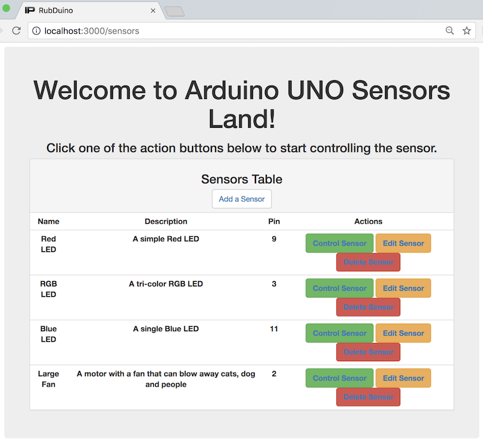

## Epicodus Capstone project: rub_duino

##### by Ron Craig (ron.craig@comcast.net ∙ https://github.com/r-craig73 ∙ https://linkedin.com/in/craigronald)

#### GitHub repository: https://github.com/r-craig73/rub_duino

### Description
#### An application combining Arduino HW & Ruby on Rails to let a user interact with a sensor (LED light).

### Home Page Screenshot
<kbd></kbd>

### Blue LED Sensor Screenshot
<kbd></kbd>

### RGB (Red-Green-Blue) LED Sensor Screenshot
<kbd></kbd>

### Large Fan Sensor Screenshot
<kbd></kbd>

###  Minimum Viable Product (MVP) User and Administrator Stories
- [x] As a user, I want to turn on a sensor.
- [x] As a user, I want to turn off a sensor.
- [x] As a user, I want to a sensor to quickly turn on and off (blinking/winking).
- [x] As a user, I want to control different sensors.
- [x] As a user, I want to CURD-L sensor capabilities.

### Post MVP User and Administrator stories
- [ ] User Authentication between Administrator and Users (email and password)
- [ ] As a user, I want to turn on multiple sensors (new interface).
- [ ] As a user, I want to customize a sensor's action (on/off, blinking/sensor, etc.).
- [ ] As a user, I want to to know when a sensor is either working or not working.
- [ ] As a user, I want to record and store time and the LED light voltage's value into a database.
- [ ] As a user, I want to record and store time and the LED light color into a database.
- [ ] As a user, I want to select and visualize my sensor results within the application (voltage vs. time, line graph, etc.).
- [ ] As a user, I want to sensor to alert about a certain event (Portland news, a special alert, earthquake warning, etc.).
- [ ] As a admin, I want CURD-L capabilities for ALL users.
- [ ] As a admin, I want users to have '--R--L' (out of CRUD-L) capabilities on other user's sensors.

## `rub_dino` Arduino UNO HW schematics and diagram
<kbd></kbd>

<kbd></kbd>

### Instructions (assuming Mac OS)
* Clone repository and move to the home repository folder `rub_duino`.
* Run `$ gem install rails`.
* Verify that you are using ruby-2.4.1 in your terminal(s).
* Run `$ bundle install` to install Ruby gems packages related to the Gemfile in the top level.
* Rspec setup (Unit Testing and Models): In the terminal, run the following command `$ bundle exec rails generate rspec:install`. Files will be generated in the spec folder. In the home repository folder run `$ rspec` to view tests passing or failing.
* Dino installation: Insert `gem 'dino'` in the `Gemfile` and run `$ bundle install` to install the rubygem. Download and install the Arduino IDE software. After verifying USB connection to your Arduino device, open the `rub_duino/du/du.ino` file.  Upload the file (right arrow) to install dino. You can now close the Arduino software.  Detailed instructions are located in https://github.com/austinbv/dino.
* Database setup: Run `$ rails db:create` to generate a database. Run `$ rails generate migration action_name` generate a migration file for table manipulation. After generating the necessary tables, run `$ rails db:migrate` to prepare the database. Run `$ rails db:test:prepare` to create the Active Record schema.rb file. To run a seed to populate a database, run `$ rails db:seed`.
* In a terminal, start postgres database system `$ postgres`
* In another terminal, start Rails server `$ rails server`. Navigate a web browser (Chrome, Firefox, etc.) to `http://localhost:3000`. Refresh the page to reload any changes to the source files.

## Bugs
* Possible latency issues between either Arduino card or rails server.

## Technologies Used
```
Application: ruby-2.4.1, Bootstrap, HTML, postgres
Testing: Rails 5.2.0, rspec
Environment: rubygems
```

#### Sources and Inspiration
* _Getting Started with Arduino_ 2nd Edition by Massimo Banzi
* Interfacing Arduino and Ruby: https://playground.arduino.cc/Interfacing/Ruby
* Introducing Arduino and Ruby: http://tutorials.jumpstartlab.com/projects/arduino/introducing_arduino.html
* Dreaming echoes: http://dreamingechoes.github.io/arduino/ruby/rails/physical-software-made-easy-with-arduino-and-ruby-on-rails/
* Connecting Rails and Arduino with a serial port: https://medium.com/@jaeger.rob/connecting-rails-and-arduino-with-serialport-859b8e58db39
* Ruby the Arduino way presentation by Austin Vance: http://confreaks.tv/videos/rubyconf2012-arduino-the-ruby-way
* Setup a link to run a ruby function using Ruby on rails: https://stackoverflow.com/questions/11477191/how-do-i-run-ruby-code-on-a-button-click

Copyright (c) 2018 **_RC productions_**

## MIT License
-----------
Permission is hereby granted, free of charge, to any person obtaining a copy of this software and associated documentation files (the "Software"), to deal in the Software without restriction, including without limitation the rights to use, copy, modify, merge, publish, distribute, sublicense, and/or sell copies of the Software, and to permit persons to whom the Software is furnished to do so, subject to the following conditions:

The above copyright notice and this permission notice shall be included in all copies or substantial portions of the Software.

THE SOFTWARE IS PROVIDED "AS IS", WITHOUT WARRANTY OF ANY KIND, EXPRESS OR
IMPLIED, INCLUDING BUT NOT LIMITED TO THE WARRANTIES OF MERCHANTABILITY,
FITNESS FOR A PARTICULAR PURPOSE AND NON-INFRINGEMENT. IN NO EVENT SHALL THE AUTHORS OR COPYRIGHT HOLDERS BE LIABLE FOR ANY CLAIM, DAMAGES OR OTHER
LIABILITY, WHETHER IN AN ACTION OF CONTRACT, TORT OR OTHERWISE, ARISING FROM, OUT OF OR IN CONNECTION WITH THE SOFTWARE OR THE USE OR OTHER DEALINGS IN THE SOFTWARE.
